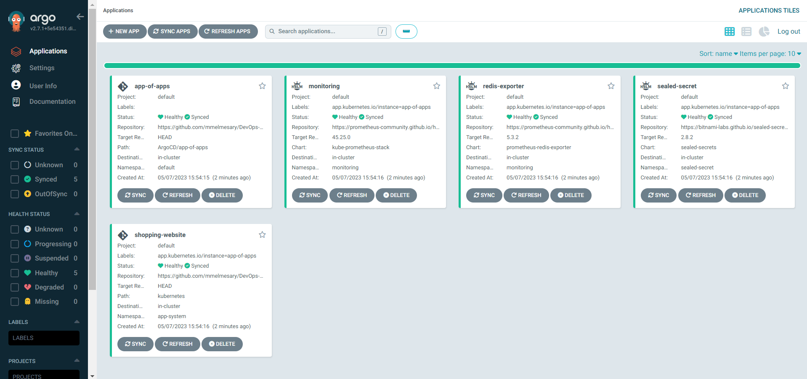

# ArgoCD for GitOps automation 

## Overview
> This repository contains configuration files for deploying multiple applications to a Kubernetes cluster using ArgoCD, a tool for continuous delivery of Kubernetes applications.
## Step 1: Install ArgoCD and ArgoCD CLI tool

 **We first need to create a namespace for ArgoCD and install it.**
  ```bash
  kubectl create namespace argocd
  kubectl apply -n argocd -f https://raw.githubusercontent.com/argoproj/argo-cd/stable/manifests/install.yaml
  ```
**Check all resources get installed** 
  ```bash
  kubectl get all -n argocd
  ```
**Install ArgoCD CLI**
> You can download the latest Argo CD version from **[the latest release page of this repository](https://github.com/argoproj/argo-cd/releases/tag/v2.7.1)**, which will include the argocd CLI

## Step 2: Configuring ArgoCD:
 
  ```bash
  kubectl port-forward svc/argocd-server -n argocd 8080:443
  ```
We must now get our credentials to login.

  ```bash
  kubectl -n argocd get secret argocd-initial-admin-secret -o jsonpath="{.data.password}" | base64 -d
  ```
This secret where the argocd server password is stored is not secure and should be deleted after updating the password with the command below.
  
  ```bash
  argocd account update-password
  ```

## step 3: Declarative Setup - App-of-Apps
> To deploy our apps, we will use the declarative setup approach with an "App-of-Apps" configuration. This approach allows us to manage multiple applications as a single entity, which simplifies the deployment process and makes it easier to maintain and scale.

To deploy the App-of-Apps configuration, run the following command:

```bash
kubectl apply -f ArgoCD/multi-app/app-of-apps.yaml
```
when we run the command above this will creates all apps in the app-of-apps directory

 

