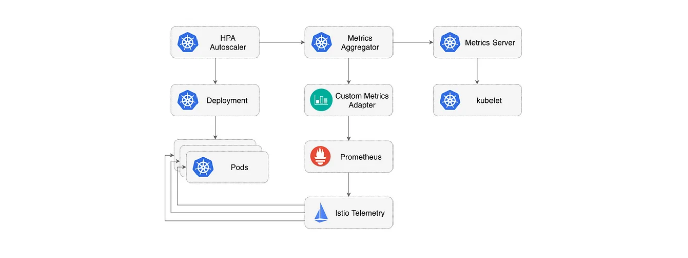

# Autoscaling Kubernetes apps with Prometheus, Istio, and KEDA

What follows is a step-by-step guide on configuring the KEDA Scaledobject to get the total HTTP requests from istio service mesh and using the prometheus to scrape those metrics.

Prometheus scaler in KEDA is configured and deployed to auto-scale.

> Autoscaling is an approach to automatically scale up or down workloads based on the resource usage.
 
## First: install KEDA

We will deploy Keda using Helm provided by ArgoCD

- so first Create a new ArgoCD application for Keda using the declarative way, you can check the **[keda.yaml](https://github.com/mmelmesary/DevOps-Project/blob/master/ArgoCD/app-of-apps/keda.yaml)** in ArgoCD directory

## Second: Create a ScaledObject object.

`ScaledObject` is a custom resource that needs to be deployed in order to sync a `Deployment` with an event source (Prometheus in this case).

 The `ScaledObject` will result in corresponding autoscaling resource (HPA definition) to scale the `Deployment`.

 > When a ScaledObject gets deleted, the corresponding HPA definition is cleaned up.

 the [scaledobject-deployment.yaml](scaledobject-deployment.yaml) is the ScaledObject definition for our app which uses the Prometheus scaler 