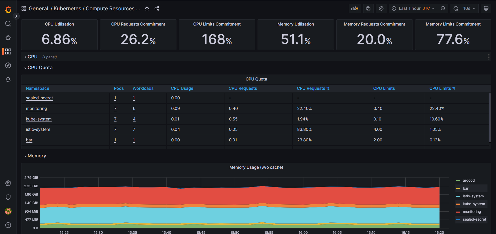
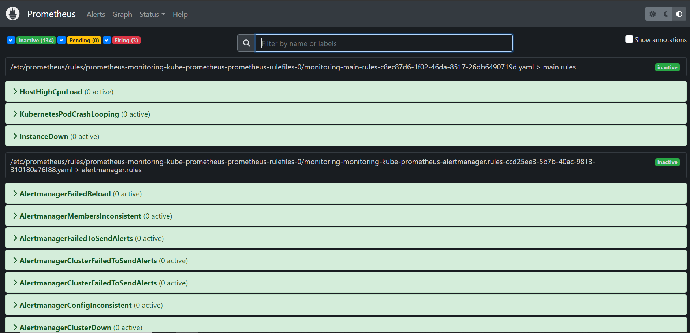

# Use Prometheus for monitoring and Grafana for virtualization

           

**We utilize ArgoCD as the deployment tool for our Prometheus stack. This is achieved by utilizing the Helm chart implementation.** you can see the application file from **[kube-prometheus-stack](../ArgoCD/app-of-apps/prometheus-stack.yaml)** in ArgoCD directory.

#### By default, this chart will deploy the following components:
- Prometheus server
- Alertmanager
- Grafana
- Prometheus node-exporter
- kube-state-metrics
- Prometheus adapter

**We can check this by viewing our pods in the monitoring namespace**

```bash
kubectl get pods -n monitoring 
```

```
NAME                                                   READY   STATUS    RESTARTS   AGE
monitoring-kube-prometheus-operator-774d4579f6-khjv8   1/1     Running   0          20m
monitoring-kube-state-metrics-6cd9475767-ll7q4         1/1     Running   0          20m
monitoring-prometheus-node-exporter-9pn6z              1/1     Running   0          20m
```
## Step1: Accessing prometheus UI & Grafana UI
#### To access the prometheus UI
  ```bash
  kubectl -n monitoring port-forward svc/monitoring-kube-prometheus-prometheus  9090:9090
  ``` 
#### To access the Grafana UI

  ```bash
  kubectl -n monitoring port-forward svc/monitoring-grafana 3000:80
  ```
- **We must get our credentials to login.**

  ```bash
  kubectl get secret -n monitoring monitoring-grafana -o=jsonpath='{.data.admin-user}' | base64 -d
  kubectl get secret -n monitoring monitoring-grafana -o=jsonpath='{.data.admin-password}' | base64 -d
  ```
    

## Step2: Creating custom roles 🚨

To monitor changes in our Kubernetes cluster and receive alerts through Slack, we will create custom rules using Prometheus and Alertmanager. 

1. `rules.yaml` file

```bash
kubectl apply -f ./monitoring/rules.yaml
```
The rules in the file rules.yaml which we applied in the command above define `four` alerts: `PodCrashLoopBackOff`, `HighCPUUsage`, `HighMemoryUsage`, and `InstanceDown`. They use Prometheus metrics to monitor the state of pods, container resources and if instance goes down in our cluster.

2. `redis-rules.yaml` file

```bash
kubectl apply -f ./monitoring/redis-rules.yaml
```
The rule in the file redis-rules.yaml which we applied in the command above define if the redis instance goes down, immediately firing the alert
____
**Prometheus alerts in prometheus UI**

   

___

# Setting up Prometheus Alertmanager with Slack
> setting up Prometheus Alertmanager to send notifications to a slack channel 

**We will configure alertmanager to send notifications if:**
- If any instance has more CPU than 75%
- If any container consumes memory more than 2 GB
- If any node goes down
- If any pod restarts more than 4 times
- If redis service goes down

### Step1: 

If you want to receive notifications via Slack, you should be part of a Slack workspace.

To set up alerting in your Slack workspace, you are going to need a `Slack API URL`. Go to **Slack -> Administration -> Manage apps**, search for `Incoming WebHooks` and add it to your Slack workspace.

After you confirm and add Incoming WebHooks integration, webhook URL (which is your Slack API URL) is displayed. Copy it.


### Step 2:

**Install bitanmi sealed-secet** to encrypt our secret file, so no one can decrypt our secet unless the kubeseal installed in our cluster

> We install bitnami sealed-secret using ArgoCD, you can see the application file from **[sealed-secret.yaml](../../ArgoCD/app-of-apps/sealed-secret.yaml)** in ArgoCD directory.

**Create these two files**

```bash
kubectl apply -f ./monitoring/notifications/alert-manager.yaml
kubectl apply -f ./monitoring/notifications/alert-sealed-secret.yaml
```

### You can test that the alertmanager works correctly 

```bash
kubectl run cpu-test --image containerstack/cpustress -- --cpu 4 --timeout 30s --metrics-brief 
```
___
**✨ Contents**, our alert sucessfully get sent to our slack channel :tada:

 

#### Don't forget to delete the pod that we used to fire the alert to confirm that our alert works successfully

```bash
kubectl delete pod cpu-test
```
___

# Monitoring ArgoCD

<p align="center">

</p>

**In order to successfully monitor ArgoCD, it is necessary to pass through specific service monitors. These monitors allow Prometheus to pick up the essential metrics generated by ArgoCD, check the files at `argocd metrics` directory

```bash
cd Monitoring/argocd-metrics/
```

# Grafana dashboards to Visualize ArgoCD metrics

**To import the Grafana dashboard, you need to first copy the **[Unique ID](https://grafana.com/grafana/dashboards/14584-argocd/)** associated with it**

```
Dashboard ID = 14584
```
 