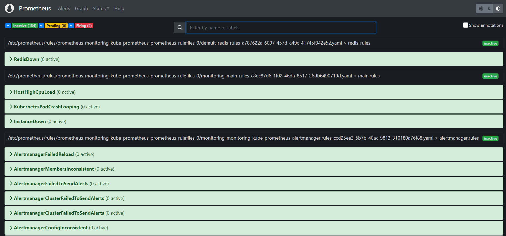

# Use Prometheus for monitoring and grafana for virtualiztion

           

**we utilize ArgoCD as the deployment tool for our Prometheus stack. This is achieved by utilizing the Helm chart implementation.** you can see the application file from **[kube-prometheus-stack](../ArgoCD/app-of-apps/prometheus-stack.yaml)** in ArgoCD directory.

#### By default, this chart will deploy the following components:
- Prometheus server
- Alertmanager
- Grafana
- Prometheus node-exporter
- kube-state-metrics
- Prometheus adapter

**We can check this by viewing our pods in the monitoring namespace**

```bash
kubectl get pods -n monitoring 
```
## Step1: Accessing prometheus UI & grafana UI
#### To access the prometheus UI
  ```bash
  kubectl -n monitoring port-forward svc/monitoring-kube-prometheus-prometheus  9090:9090
  ``` 
#### To access the grafana UI
  ```bash
  kubectl -n monitoring port-forward svc/monitoring-grafana 3000:80
  ```
- **We must get our credentials to login.**

  ```bash
  kubectl get secret -n monitoring monitoring-grafana -o=jsonpath='{.data.admin-user}' | base64 -d
  kubectl get secret -n monitoring monitoring-grafana -o=jsonpath='{.data.admin-password}' | base64 -d
  ```
    

## Step2: Creating custom roles 🚨

To monitor changes in our Kubernetes cluster and receive alerts through Slack, we will create custom rules using Prometheus and Alertmanager. 

1. `rules.yaml` file

```bash
kubectl apply -f ./monitoring/rules.yaml
```
The rules in the file rules.yaml which we applied in the command above define `four` alerts: `PodCrashLoopBackOff`, `HighCPUUsage`, `HighMemoryUsage`, and `InstanceDown`. They use Prometheus metrics to monitor the state of pods, container resources and if instance goes down in our cluster.

2. `redis-rules.yaml` file

```bash
kubectl apply -f ./monitoring/redis-rules.yaml
```
The rule in the file redis-rules.yaml which we applied in the command above define if the redis instance goes down, immediately firing the alert
____
**Prometheus alerts in prometheus UI**

   