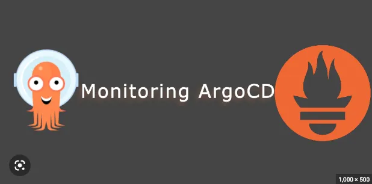

# Monitoring ArgoCD

<p align="center">

</p>

**In order to successfully monitor ArgoCD, it is necessary to pass through specific service monitors. These monitors allow Prometheus to pick up the essential metrics generated by ArgoCD**

# Grafana dashboards to Visualize ArgoCD metrics

**To import the Grafana dashboard, you need to first copy the **[Unique ID](https://grafana.com/grafana/dashboards/14584-argocd/)** associated with it**

```
Dashboard ID = 14584
```
 