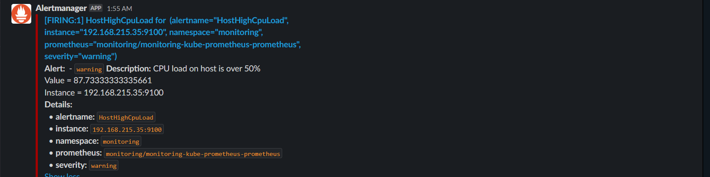

# Setting up Prometheus Alertmanager with Slack
> setting up Prometheus Alertmanager to send notifications to a slack channel 

**We will configure alertmanager to send notifications if:**
- If any instacnce has more cpu than 75%
- If any container consumes memory more than 2 GB
- If any node goes down
- If any pod restarts more than 4 times
- If redis service goes down

## Step1: 

If you want to receive notifications via Slack, you should be part of a Slack workspace.

To set up alerting in your Slack workspace, you are going to need a `Slack API URL`. Go to **Slack -> Administration -> Manage apps**, search for `Incoming WebHooks` and add it to your Slack workspace.

After you confirm and add Incoming WebHooks integration, webhook URL (which is your Slack API URL) is displayed. Copy it.


## Step 2:
**Create these two files**

```bash
kubectl apply -f ./monitoring/notifications/alert-manager.yaml
kubectl apply -f ./monitoring/notifications/alert-secret.yaml
```

### You can test that the alertmanager works correctly 

```bash
kubectl run cpu-test --image containerstack/cpustress -- --cpu 4 --timeout 30s --metrics-brief 
```
___
**✨ Contents**, our alert sucessfully get sent to our slack channel :tada:

 

#### Don't forget to delete the pod that we used to fire the alert to confirm that our alert works successfully

```bash
kubectl delete pod cpu-test
```