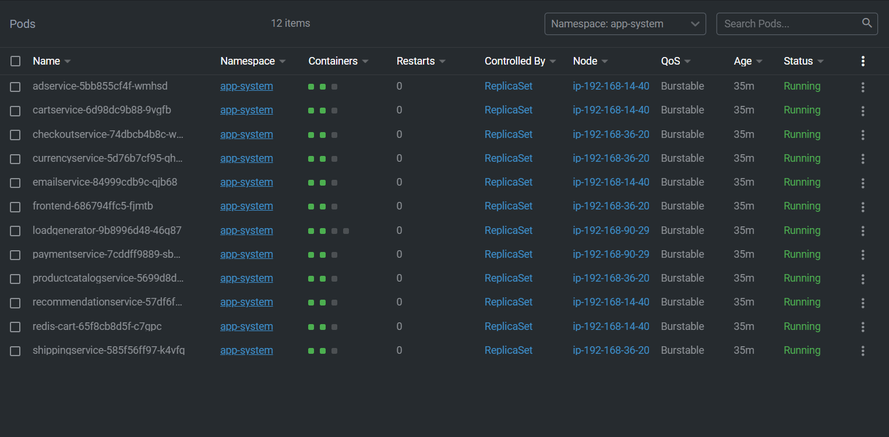
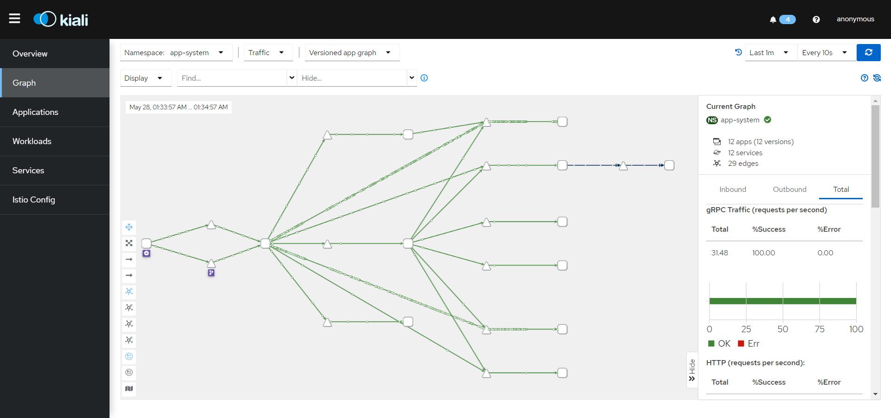
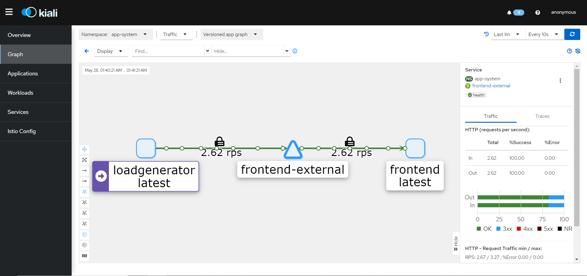

# Deploying Istio to cluster

This directory provides an `istio-manifests` files containing ingress resources (an Istio Gateway and VirtualService) needed to expose the app frontend running inside a Kubernetes cluster

> I recomended follow the [`istio`](https://istio.io/latest/docs/setup/getting-started/) documentation and follow the guide step by step

## Prerequisites
- [X] download the latest release of istio

## Step 1: Install Istio
1. we use the demo configuration profile

  ```bash
  istioctl install --set profile=demo -y
  ```

1. Add a namespace label to instruct Istio to automatically inject Envoy sidecar proxies when you deploy your application later

  ```bash
  kubectl label namespace app-system istio-injection=enabled
  ```
> `note:`choose the namespace that you will deploy your app on it

1. Deploy your app

**we utilize ArgoCD as the deployment tool for our app.** you can see the application file from **[shopping-website](../ArgoCD/app-of-apps/shopping-website.yaml)** in ArgoCD directory.

1. Run `kubectl get pods` to see pods are in a healthy and ready state.

 > you should see that each pod has `two containers` up and running 

   

> I use [`lens`](https://k8slens.dev/) to provide a powerful and intuitive way to view and manage our Kubernetes clusters

## Install Kiali and the other addons 

> Change the directory to istio directory that you dwonload 
 
  ```bash
  kubectl apply -f samples/addons
  kubectl rollout status deployment/kiali -n istio-system
  ```

 Install the Istio Gateway and VirtualService needed to expose the app frontend running inside a Kubernetes cluster

  ```bash
  kubectl apply -f istio-mainfests
  ```
 ## Access the kiali UI

   ```bash
   kubectl port-forward svc/kiali -n istio-system 20001:20001
   ```


## Explore default mTLS behavior.

Starting in Istio 1.5, the default Istio mTLS behavior is "auto." This means that pod-to-pod traffic will use mutual TLS by default, but pods will still accept plain-text traffic for instance, from pods in a different namespaces that are not injected with the Istio proxy. Because we deployed the entire sample app into one namespace `app-system` and all pods have the Istio sidecar proxy, traffic will be mTLS for all the sample app workloads. Let's look at this behavior.

