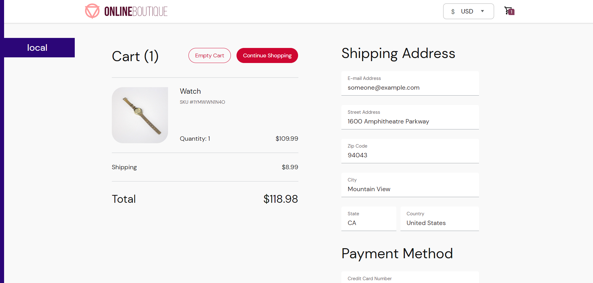

## Overview

**Online Boutique** is a cloud-first microservices demo application. Online Boutique consists of an **11-tier microservices application**. The application is a web-based e-commerce app where users can browse items, add them to the cart, and purchase them.

## Architeture

**Online Boutique** is composed of 11 microservices written in different languages that talk to each other over gRPC.


#### Copyright 2018 Google LLC
> **Referance: https://github.com/GoogleCloudPlatform/microservices-demo.git**

## deploying our app

**we utilize ArgoCD as the deployment tool for our app.** you can see the application file from **[shopping-website](../ArgoCD/app-of-apps/shopping-website.yaml)** in ArgoCD directory.

**Access the application using frontend-external service `loadbalancer`**

    ```bash
    kubectl get svc frontend-external -o jsonpath="{.status.loadBalancer.ingress[0].hostname}"
    ```

 
 